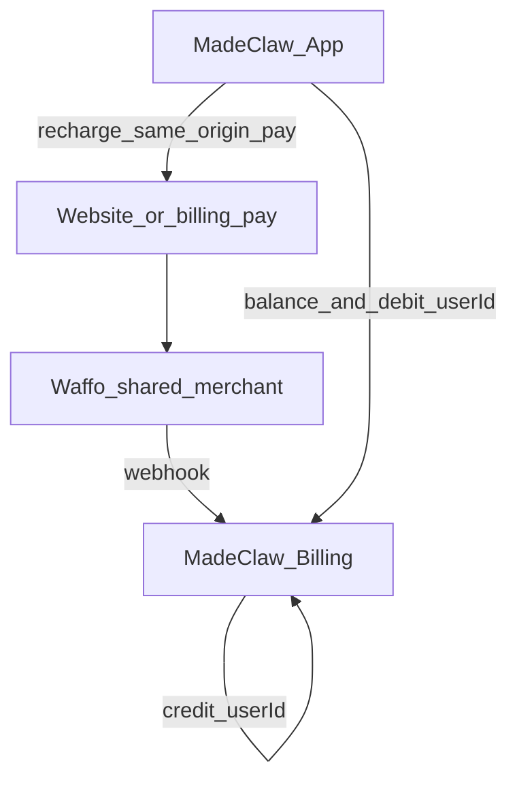

# MadeClaw 支付口径（最终）

与 MadeAPI **只共用 Waffo 收款账号**。  
**充值跳转网站**；日常在 MadeClaw App。线上站见 `railway-app/`，本机原型见 `billing/`，对接见 `PAY-CONTRACT.md`。

**不变量：充值到账额度 = 可扣余额**（同一 `userId` 账本：webhook credit → balance → debit）。

`billingBaseUrl` ≡ `payBaseUrl` ≡ 公开 origin（**OOB** `https://madeclaw.up.railway.app`；本机 `http://127.0.0.1:8787`）。  
`serviceToken` ≡ `MADECLAW_DEFAULT_SERVICE_TOKEN`（`madeclaw-oob-service-token-v1`）除非显式覆盖。  
**不要**配置 `https://xuyc.up.railway.app/pay`（Open WebUI）。  
运营核对：[`docs/OPERATOR-BALANCE.md`](docs/OPERATOR-BALANCE.md)。  
白标 DMG 改名换标：Xcode 26.4+ 后续交付。
